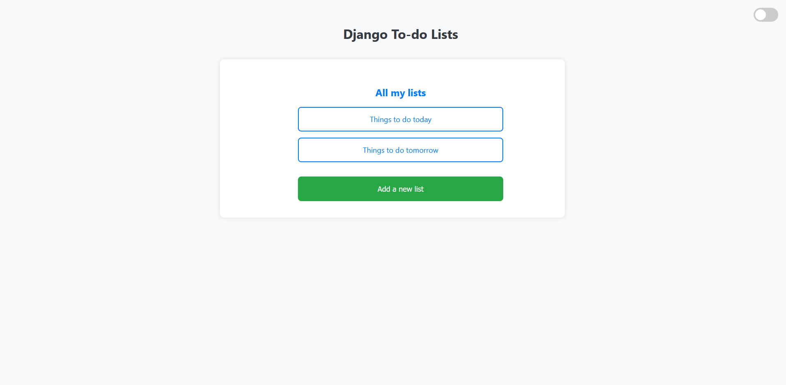
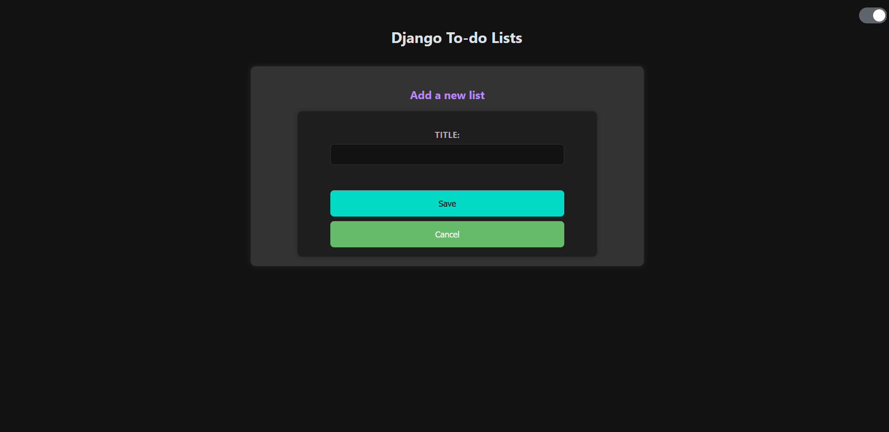
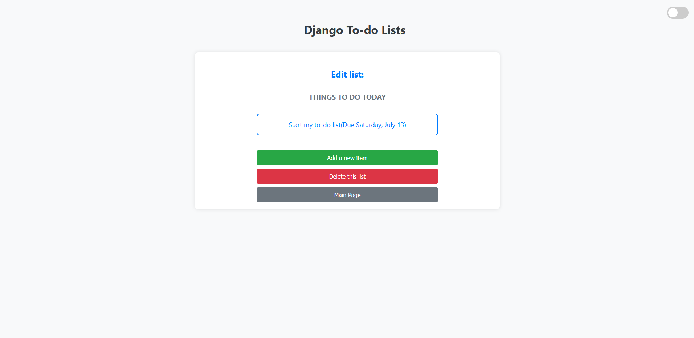

# Django Todo Web Application

This is a Django-based web application for managing todo lists and tasks.

## Features

- Create, update, and delete todo lists and tasks
- Dark and light theme options
- Responsive design

## Installation

1. Clone the repository:

git clone https://github.com/SKarthi97/todo-web-app.git
cd todo-web-app

2. Install dependencies:

pip install -r requirements.txt

3. Apply migrations:

python manage.py makemigrations todo_app
python manage.py migrate

4. Run the development server:

python manage.py runserver

5. Access the application at `http://localhost:8000/`

## Usage

- Navigate to the homepage to view existing todo lists and tasks.
- Click on "Create New List" to create a new todo list.
- Add tasks to a list by clicking on "Add Task" within the list view.
- Use the theme toggle switch at the top right to switch between dark and light themes.

## Screenshots

## Contributing

Contributions are welcome! Please fork the repository and submit a pull request.

## License

This project is licensed under the MIT License - see the [LICENSE](LICENSE) file for details.

## Acknowledgments

- This project was developed using Django and Bootstrap.
- Inspired by https://realpython.com/django-todo-lists/.
